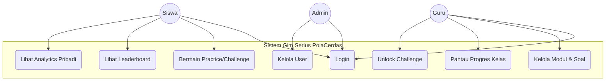
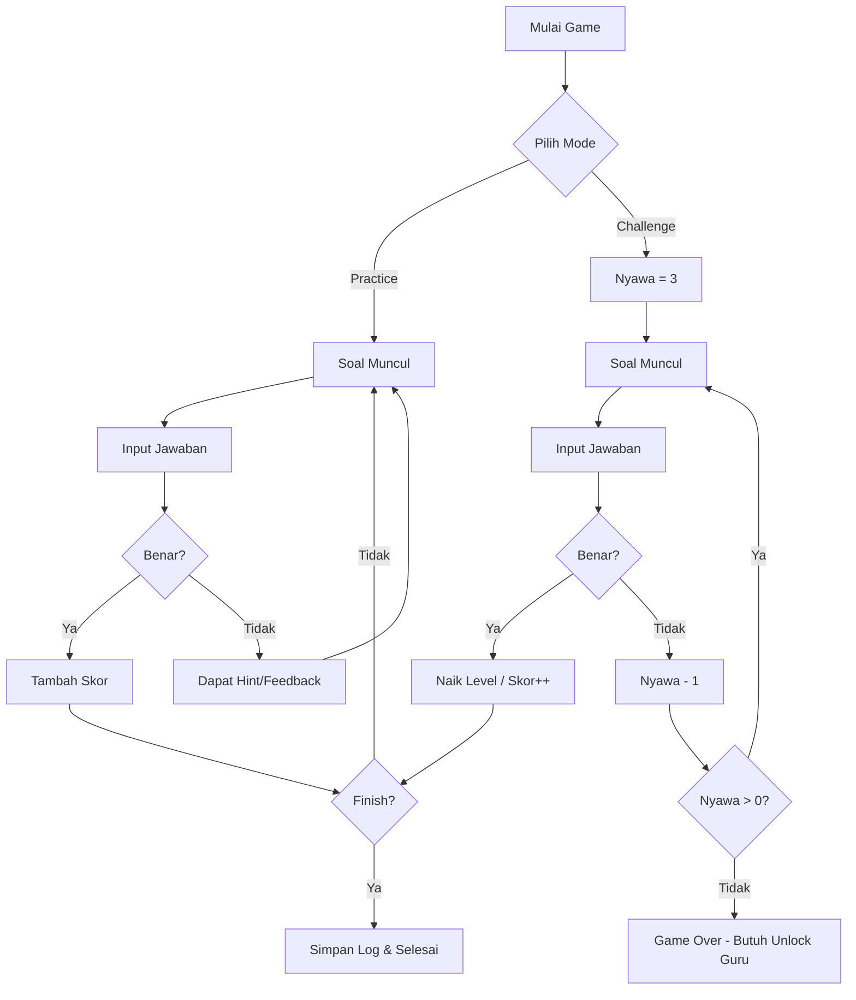
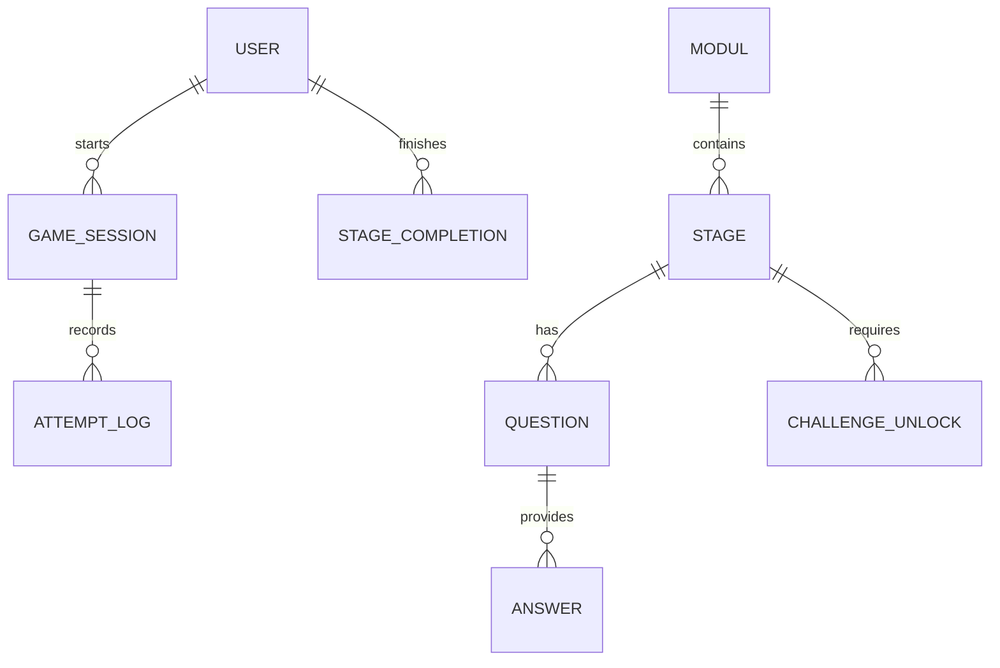

# Dokumen Analisis Kebutuhan dan Spesifikasi Sistem
## Proyek: Gim Serius PolaCerdas (Kiro One)

---

### 1. PENDAHULUAN
Dokumen ini merinci kebutuhan fungsional, non-fungsional, serta spesifikasi teknis untuk aplikasi *Gim Serius PolaCerdas* yang dirancang untuk mendukung pembelajaran konsep Teknologi Digital dan Keterampilan Berpikir Komputasi (*Computational Thinking*). Sistem ini memungkinkan siswa belajar melalui tantangan interaktif, sementara guru dapat memantau progres dan menganalisis kesalahan siswa.

---

### 2. ANALISIS KEBUTUHAN

#### 2.1 Kebutuhan Fungsional (Functional Requirements)

| Peran (Actor) | Fitur Utama | Deskripsi |
| :--- | :--- | :--- |
| **Siswa** | Autentikasi | Login ke dalam sistem. |
| | Dashboard | Melihat progres belajar, modul yang tersedia, dan skor total. |
| | Gameplay (Practice) | Mengerjakan soal dengan nyawa tak terbatas dan mendapatkan feedback/hint. |
| | Gameplay (Challenge)| Mengerjakan soal dengan nyawa terbatas (3). Jika gagal, butuh unlock dari Guru. |
| | Leaderboard | Melihat peringkat skor dibandingkan siswa lain. |
| | Analytics Siswa | Melihat statistik performa pribadi per stage. |
| **Guru** | Manajemen Konten | Membuat, mengedit, dan menghapus Modul, Stage, dan Soal (PG/Isian). |
| | Manajemen Soal | Mengatur tingkat kesulitan (Easy, Medium, Hard) dan media (gambar/audio). |
| | Analytics Kelas | Memantau progres seluruh siswa, akurasi, dan waktu pengerjaan. |
| | Analisis Miskonsepsi| Melihat pilihan jawaban salah yang paling sering dipilih siswa. |
| | Challenge Unlock | Membuka akses pengerjaan ulang mode Challenge bagi siswa yang gagal. |
| **Admin** | Manajemen User | Menambah/menghapus akun Guru dan Siswa. |
| | Dashboard Global | Melihat ringkasan aktivitas seluruh sistem. |

#### 2.2 Kebutuhan Non-Fungsional
*   **Keamanan**: Enkripsi password menggunakan Bcrypt.
*   **Ketersediaan**: Sistem dapat diakses melalui browser (Web-based).
*   **Skalabilitas**: Struktur database mendukung penambahan modul dan soal dalam jumlah besar.
*   **User Interface**: Responsif dan menarik menggunakan komponen visual untuk mendukung pengalaman bermain.

---

### 3. SPESIFIKASI SISTEM

#### 3.1 Tech Stack
*   **Backend**: Python 3.x dengan Framework Flask.
*   **Database**: SQLite (SQLAlchemy ORM).
*   **Frontend**: HTML5, Jinja2, Vanilla CSS.
*   **Rich Text Editor**: Quill.js (untuk pembuatan konten soal).
*   **Library Utama**: Flask-Login (Auth), Flask-Bcrypt (Security), Pillow (Image Processing).

#### 3.2 Arsitektur Data (Entity Relationship)
Sistem menggunakan struktur relasional untuk menghubungkan pengguna, konten kurikulum, dan log permainan.

#### 3.3 Sistem Penilaian (Scoring System)
Sistem skor bersifat akumulatif dan tidak terbatas (uncapped) untuk memberikan diferensiasi yang lebih baik antar siswa:
*   **Poin Dasar**: Easy (100), Medium (150), Hard (200).
*   **Bonus Waktu**: Hadiah hingga 50% dari poin dasar jika menjawab lebih cepat dari target waktu.
*   **Bonus Strategis**: +500 poin untuk penyelesaian stage (Stage Clear) dan +100 poin per sisa nyawa (Health Bonus).
*   **Mastery**: Dihitung berdasarkan bobot kesulitan (1, 2, 3) untuk keperluan statistik kompetensi dan spider chart.

---

### 4. DIAGRAM DAN FLOWCHART

#### 4.1 Use Case Diagram

#### 4.2 Flowchart Alur Permainan (Game Logic)

#### 4.3 Entity Relationship Diagram (ERD)

---

### 5. TABEL SPESIFIKASI DATA (DATABASE)

| Tabel | Kolom Utama | Deskripsi |
| :--- | :--- | :--- |
| **users** | id, username, password, role, total_points | Data pengguna dan perannya. |
| **moduls** | id, title, order_index, is_active | Kelompok besar materi. |
| **stages** | id, modul_id, title, difficulty, mode | Level permainan. |
| **questions** | id, stage_id, type, content_text, ct_skills, digital_tech | Data soal (PG/Isian) dan pemetaan kompetensi. |
| **game_sessions**| id, user_id, stage_id, mode, nyawa | Sesi aktif saat siswa bermain. |
| **attempt_logs** | id, session_id, question_id, is_correct, time_spent | Log jawaban detail untuk penelitian/analytics. |
| **stage_completions**| id, user_id, accuracy, mastery_percentage, score | Rekap hasil akhir per level. |

---

### 6. PEMETAAN KOMPETENSI (Computational Thinking)
Sistem melacak 5 keterampilan utama CT:
1.  **Decomposition**: Memecah masalah besar menjadi kecil.
2.  **Abstraction**: Fokus pada informasi relevan.
3.  **Modelling & Simulation**: Representasi model.
4.  **Algorithms**: Langkah-langkah logis penyelesaian.
5.  **Evaluation**: Mengecek kebenaran solusi.
